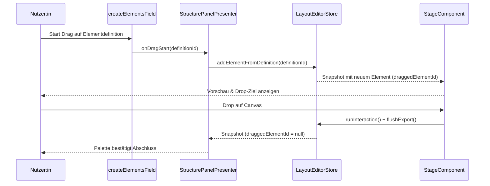

# Elements Module

Dieses Verzeichnis bündelt alle Layout-Editor-Komponenten, die als **Elements** im Preview, im Inspector und in Modals gerendert werden. Die Implementierungen bauen auf geteilten Basisklassen auf, registrieren sich über das Manifest und stellen UI-Hilfen für Palette, Stage und Inspector bereit.

## Struktur & Zuständigkeiten

```
elements/
├── README.md             – Leitfaden (diese Datei)
├── base.ts               – Basisklassen & Kontrakte
├── component-manifest.ts – Generiertes Manifest (nicht manuell editieren)
├── registry.ts           – Lookup für Elementdefinitionen
├── ui.ts                 – UI-Primitiven für Palette & Inspector
├── components/           – Konkrete Elementimplementierungen
└── shared/               – Basishilfen für Komponenten & Renderer
```

| Pfad | Beschreibung |
| --- | --- |
| [`base.ts`](./base.ts) | Deklariert `LayoutElementComponent`, Preview-/Inspector-Kontexte sowie Factory-Signaturen, die von allen Element-Implementierungen genutzt werden. |
| [`component-manifest.ts`](./component-manifest.ts) | Build-Artefakt, das alle registrierten Komponenten exportiert. Wird von [`registry.ts`](./registry.ts) eingelesen und sollte nicht manuell bearbeitet werden. |
| [`registry.ts`](./registry.ts) | Zentraler Einstieg zum Nachschlagen von Elementdefinitionen. Bindet das Manifest ein und bietet Helfer für Palette, Defaultwerte und Inspector. |
| [`ui.ts`](./ui.ts) | Liefert UI-Primitiven (z. B. `createElementsField`, `createElementsSelect`) für Preview- und Inspector-Flows. Nutzt die generischen Controls aus [`../ui/components`](../ui/components). |
| [`shared/`](./shared/README.md) | Enthält wiederverwendbare Basisklassen und Renderer für Element-Previews. Details in der [Shared-Dokumentation](./shared/README.md). |
| [`components/`](./components/README.md) | Konkrete Elementimplementierungen für Palette & Stage. Übersicht in der [Komponenten-Dokumentation](./components/README.md). |

## Dokumentationsinventar

| Thema | Technische Quelle | Soll-Referenz (User-Wiki) |
| --- | --- | --- |
| Elemente-Basisklassen & Manifest | [`base.ts`](./base.ts), [`component-manifest.ts`](./component-manifest.ts) | [UI-Komponenten › Bibliothek & Palette](../../../docs/ui-components.md#ui-komponenten-im-%C3%BCberblick) |
| Palette-Interaktionen | [`ui.ts`](./ui.ts), [`components/`](./components/README.md) | [Stage-Bedienkonzept › Drag-Szenario](../../../docs/stage-instrumentation.md#tests--qualit%C3%A4tssicherung) |
| Inspector-Anbindung | [`ui.ts`](./ui.ts), [`../presenters/structure-panel.ts`](../presenters/structure-panel.ts) | [Setup-Workflows › View-Bindings](../../../docs/README.md#setup-workflows) |
| Performance & Rendering | [`../ui/components`](../ui/components) | [UI-Performance](../../docs/ui-performance.md) |

## Arbeitsfluss

1. **Komponente ableiten:** Neue Elemente bauen auf den Basisklassen aus [`shared/component-bases.ts`](./shared/component-bases.ts) auf oder implementieren `LayoutElementComponent` direkt.
2. **Registrieren:** Die Implementierung wird im Build-Prozess dem [`component-manifest.ts`](./component-manifest.ts) hinzugefügt und dadurch automatisch von [`registry.ts`](./registry.ts) erfasst.
3. **UI anbinden:** Preview- und Inspector-Logik verwenden die Hilfsfunktionen aus [`ui.ts`](./ui.ts) sowie die globalen Presenter in [`../presenters`](../presenters), insbesondere [`stage-controller.ts`](../presenters/stage-controller.ts) für die Stage-Interaktion.

## Kernabläufe

### Palette → Stage (Drag & Drop)
1. `createElementsField` liefert Palette-Einträge inklusive Drag-Metadaten.
2. Beim Drop ruft der Presenter `store.addElementFromDefinition()`, wobei `registry.ts` Definition und Defaultwerte liefert.
3. Die Stage empfängt den aktualisierten Snapshot und ruft `ensureContainerDefaults()` für neue Container.
4. Der Nutzer-Workflow ist im User-Wiki unter [Stage-Bedienkonzept › Drag-Szenario](../../../docs/stage-instrumentation.md#tests--qualit%C3%A4tssicherung) beschrieben.

### Inspector-Änderungen
1. Inspector-Controls verwenden `createElementsSelect`/`createElementsField` aus [`ui.ts`](./ui.ts).
2. Änderungen triggern Presenter-Callbacks (`StructurePanelPresenter` oder Header-Formulare), die `LayoutEditorStore.updateElement()` aufrufen.
3. Der Store publiziert den Snapshot; Previews nutzen `syncElementNode` um nur betroffene Attribute zu patchen.
4. Der Soll-Zustand für diese Bearbeitungsschritte ist im User-Wiki unter [Setup-Workflows › View-Bindings](../../../docs/README.md#setup-workflows) dokumentiert.

### Manifest-Erweiterung
1. Neue Komponenten werden in `components/` abgelegt.
2. `npm run build` führt das Manifest-Script aus und registriert die Komponente in `component-manifest.ts`.
3. `registry.ts` stellt die Definition bereit; Palette, Stage und Inspector erhalten sie beim nächsten Import.

### Sequenzdiagramm: Drag & Drop Palette → Stage



Die Sequenz deckt den Soll-Ablauf „Palette → Stage“ aus dem User-Wiki ab ([Tests & Qualitätssicherung › Drag-Szenario](../../../docs/stage-instrumentation.md#tests--qualit%C3%A4tssicherung)). Automatisierte Coverage für Palette-Registrierungen befindet sich in [`../../tests/view-registry.test.ts`](../../tests/view-registry.test.ts). Offene Diagramme für angrenzende A11y-Aspekte sind im To-Do [`ui-accessibility-and-diagrams.md`](../../todo/ui-accessibility-and-diagrams.md) hinterlegt.

## Registry- & Manifest-Pipeline

| Schritt | Verantwortlich | Hinweise |
| --- | --- | --- |
| Manifest generieren | [`scripts/generate-component-manifest.mjs`](../../scripts/generate-component-manifest.mjs) | Liest alle Dateien aus [`components/`](./components) ein, sortiert sie alphabetisch und erzeugt [`component-manifest.ts`](./component-manifest.ts). Script **niemals** manuell anfassen. |
| Build-Trigger | [`npm run build`](../../package.json) | Führt zuerst das Generator-Script aus und startet danach den Bundle-Task [`esbuild.config.mjs`](../../esbuild.config.mjs). Jeder neue Component-Commit muss einmal mit diesem Befehl gebaut werden, damit das Manifest konsistent bleibt. |
| Manueller Refresh | `node scripts/generate-component-manifest.mjs` | Schneller Rebuild, wenn nur das Manifest aktualisiert werden soll (z. B. nach einem Datei-Umbenennen). Stellt sicher, dass `component-manifest.ts` im Repo aktualisiert wird. |
| Qualitätschecks | `npm run lint`, `npm run test`, `npm run format` | Stellen sicher, dass neue Komponenten das Manifest korrekt referenzieren: Lint verhindert fehlende Exporte, die Tests prüfen Preview-Hooks und Format stellt konsistente Sortierung sicher, weil das Script deterministisch schreibt. |

> **Pflicht:** Commits, die neue Komponenten hinzufügen oder umbenennen, müssen das generierte `component-manifest.ts` enthalten. Der CI-Lint schlägt fehl, sobald eine Datei im [`components/`](./components) Ordner fehlt oder der Generator nicht ausgeführt wurde.

## Verwandte Dokumente

- [Element Preview API](../element-preview.ts) – definiert, wie Previews im Editor gerendert werden.
- [View Registry](../view-registry.ts) – stellt Feature-Bindings bereit, die z. B. vom `view-container` genutzt werden.
- [UI-Komponenten](../ui/components) – Basisbausteine für Palette, Inspector und Modals.
- Nutzerperspektive & Soll-Zustand: [`../../../docs/README.md`](../../../docs/README.md)

## Offene Punkte

- Sequenzdiagramme & Barrierefreiheit: [`ui-accessibility-and-diagrams.md`](../../todo/ui-accessibility-and-diagrams.md).
- Shortcut-Testabdeckung ergänzen: [`ui-shortcut-coverage.md`](../../todo/ui-shortcut-coverage.md).
