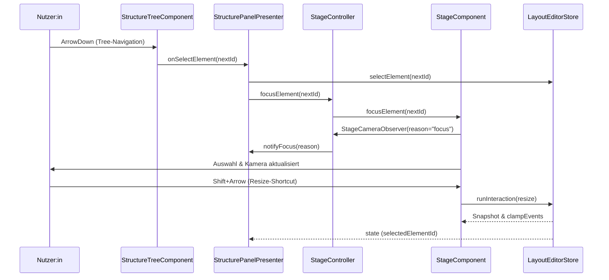

# Presenters

Presenter-Klassen überbrücken das State-Layer und wiederverwendbare UI-Komponenten. Sie hören auf den `LayoutEditorStore`, übersetzen State-Events in gezielte UI-Aktualisierungen und koordinieren Fokus- sowie Telemetrie-Signale zwischen Tree, Stage und Kopfzeile. Architekturhinweise zum Rendering finden sich in den [UI-Performance-Guidelines](../../docs/ui-performance.md).

## Struktur

```
presenters/
├── README.md              – Dokument (dieser Leitfaden)
├── header-controls.ts     – HeaderControlsPresenter für Bibliothek & Persistenzmeldungen
├── stage-controller.ts    – StageController für Canvas-Rendering & Kamera-Telemetrie
└── structure-panel.ts     – StructurePanelPresenter für Tree-Auswahl & Drag/Drop
```

## Dokumentationsinventar

| Thema | Technische Quelle | Soll-Referenz (User-Wiki) |
| --- | --- | --- |
| Fokus- & Kamera-Kopplung | [`stage-controller.ts`](./stage-controller.ts) | [Stage-Instrumentierung › Kamera-Telemetrie](../../../docs/stage-instrumentation.md#kamera-telemetrie) |
| Strukturbaum-Delegation | [`structure-panel.ts`](./structure-panel.ts) | [UI-Komponenten › Strukturbaum](../../../docs/ui-components/structure-tree.md#prim%C3%A4re-interaktionen) |
| Persistenz-Feedback | [`header-controls.ts`](./header-controls.ts) | [User-Wiki › Fehlerdiagnose & Qualitätschecks](../../../docs/README.md#fehlerdiagnose--qualit%C3%A4tschecks) |
| Shortcuts & Keyboard-Brücke | [`stage-controller.ts`](./stage-controller.ts), [`../ui/components/stage.ts`](../ui/components/stage.ts) | [UI-Komponenten › Keyboard-Shortcuts](../../../docs/ui-components.md#keyboard-shortcuts) |

## Terminologie & Rollen

- **StageController** – Verbindet Canvas, Kamera-Telemetrie und Store-Snapshots.
- **StructurePanelPresenter** – Synchronisiert Baum-Auswahl und Drag-Zustände.
- **HeaderControlsPresenter** – Spiegelt Persistenzstatus, Bibliothek und Import/Export.
- **Store** – `LayoutEditorStore`, einzige Quelle für Layout-Snapshots.

## Gemeinsame Konventionen

- Presenter kapseln DOM-Zugriffe in Komponenten. Verwende `renderComponent` für Mounting und rufe `destroy()` in `dispose()`, damit Event-Listener sicher freigegeben werden.
- Jeder Presenter cached das Unsubscribe-Handle von `store.subscribe`. Direkt nach der Initialisierung muss eine Snapshot-Synchronisierung erfolgen, damit Komponenten bereits vor dem ersten Store-Event konsistent rendern.
- Cross-Kommunikation (Fokus, Drag-Status, Fehlerbanner) erfolgt ausschließlich über Presenter-APIs statt über direkte Komponentenkopplung.
- Neue Presenter sollten ihre Abhängigkeiten (Host-Element, Store, Kollaborateure) im Konstruktor annehmen und eine `dispose()`-Methode anbieten. Verlinke vertiefende Dokumentation in [`../../docs/ui-performance.md`](../../docs/ui-performance.md) oder im [View-Registry-Guide](../../docs/view-registry.md).

## Sequenzabläufe

### Fokus & Kamera-Synchronisation
1. Tree oder Header triggern `focusElement()` auf dem `StageController`.
2. Der Controller ruft `StageComponent.focusElement()` auf und stützt sich auf die bereits aktualisierte Store-Selektion.
3. `StageComponent` emittiert einen `focus`-Event über `StageCameraObserver`; Telemetrie wird in [`../../../docs/stage-instrumentation.md`](../../../docs/stage-instrumentation.md#kamera-telemetrie) dokumentiert.
4. Der Soll-Workflow für Anwender:innen ist im User-Wiki unter [Stage-Fokus & Navigation](../../../docs/stage-instrumentation.md#kamera-telemetrie) beschrieben.

### Drag/Drop Tree ⇄ Stage
1. `StructurePanelPresenter` empfängt Drag-Events vom Tree (`onDragStateChange`, `onReparent`, `onReorder`).
2. Der Presenter delegiert an `LayoutEditorStore.setDraggedElement`, `assignElementToContainer` bzw. `moveChildInContainer`.
3. Stage und Tree verarbeiten den neuen Snapshot; Overlays nutzen `draggedElementId` für Visualisierung.
4. Abschluss (`pointerup`) löst `store.flushExport()` aus (StageController) und entfernt Drag-Highlights. User-Wiki-Referenz: [Stage-Bedienkonzept › Drag-Szenario](../../../docs/stage-instrumentation.md#tests--qualit%C3%A4tssicherung).

### Persistenzfehler & Banner
1. `HeaderControlsPresenter.saveLayout()` ruft `layout-library.saveLayoutToLibrary` auf.
2. Fehler werden über `describeLayoutPersistenceError()` normalisiert und via `showPersistenceError()` sowohl an `StatusBannerComponent` als auch `showNotice()` weitergegeben.
3. `clearPersistenceError()` entfernt Banner/Notice, sobald ein erfolgreicher Speichervorgang gemeldet wird.
4. Anwenderleitfaden siehe [User-Wiki › Fehlerdiagnose & Qualitätschecks](../../../docs/README.md#fehlerdiagnose--qualit%C3%A4tschecks).

### Shortcuts Tree ⇄ Stage



Die Shortcut-Kette folgt den Vorgaben aus dem User-Wiki ([UI-Komponenten › Keyboard-Shortcuts](../../../docs/ui-components.md#keyboard-shortcuts)). Aktuell decken [`../../tests/stage-camera.test.ts`](../../tests/stage-camera.test.ts) Fokus-Telemetrie, nicht aber die Tastenevents selbst ab; siehe To-Do [`ui-shortcut-coverage.md`](../../todo/ui-shortcut-coverage.md).

## StageController (`stage-controller.ts`)

Der `StageController` initialisiert `StageComponent`, synchronisiert Layout-Snapshots mit dem Canvas und sorgt dafür, dass Container-Defaults (`ensureContainerDefaults`) bereitstehen, bevor Pointer-Interaktionen laufen. Bei jeder Store-Änderung wird die Stage mit Elementliste, Auswahl sowie Canvas-Größe aktualisiert.

### Kamera-Telemetrie & Fokusweitergabe

- Über das optionale `cameraTelemetry`-Argument reicht der Controller einen `StageCameraObserver` an die Komponente weiter. `StageComponent.observeCamera()` liefert ein Cleanup-Lambda, das der Controller in `dispose()` aufruft. Siehe [Stage-Instrumentierung › Kamera-Telemetrie](../../../docs/stage-instrumentation.md#kamera-telemetrie).
- `focusElement()` richtet die Kamera auf das angeforderte Element aus, triggert dabei einen Telemetrie-Event (`reason: "focus"`) und stellt sicher, dass Tree-Trigger (z. B. aus dem Structure Panel) im selben Frame ein konsistentes Viewport-Abbild erhalten.
- Die Fokusweitergabe funktioniert bidirektional: Der Controller reagiert auf Store-Selektion, während externe Presenter gezielt `focusElement()` invokieren, um Kamera-Zustand und Stage-Cursor im Gleichschritt mit Tree-Auswahl zu halten.

## StructurePanelPresenter (`structure-panel.ts`)

Der Presenter versorgt den Strukturbaum (`StructureTreeComponent`) mit Snapshots aus dem Store, inklusive Auswahl- und Drag-Status. Er meldet sich an Tree-Callbacks an und übersetzt sie in Store-Mutationen.

### Fokus-Handshake Tree ⇄ Stage

- `handleSelect()` ruft das bereitgestellte `onSelectElement`-Callback auf, damit der Store die Auswahl aktualisiert. Direkt danach zieht der Presenter das Element aus dem Store und delegiert an `StageController.focusElement()`, womit Tree-Auswahl, Stage-Kamera und Telemetrie synchron bleiben.
- Die Stage reagiert auf die Telemetrie mit einem `focus`-Event, sodass Observer (Analytics, Tests) genau wissen, welcher Trigger den Sprung ausgelöst hat.

### Drag-and-Drop-Lebenszyklen

- `StructureTreeComponent` liefert Drag-Events für Reparenting (`onReparent`), Reorder (`onReorder`) und Drag-State (`onDragStateChange`).
- Beim Drag-Start setzt der Presenter `store.setDraggedElement(id)`. Dadurch können Tree und Stage Overlays denselben Drag-Status rendern.
- Beim Reparent prüft der Presenter nur die gewünschte Ziel-Container-ID und ruft `store.assignElementToContainer()`, wodurch das Store-Layer Validierungen (z. B. Container-Typen) übernimmt.
- Reorder-Operationen lesen zunächst Container/Index-Daten aus dem Store, berechnen das Ziel-Offset relativ zum aktuellen Index und reichen es an `store.moveChildInContainer()` weiter. Ungültige Moves (fehlende Container, unterschiedliche Eltern) werden früh verworfen.
- Nach dem Drop setzt das Store-Update `draggedElementId` zurück, was der Tree bei der nächsten State-Synchronisierung erkennt und UI-Highlights zurücksetzt. Die Stage erhält denselben Snapshot und entfernt Drag-Overlays synchron.

## HeaderControlsPresenter (`header-controls.ts`)

Der Header-Presenter bündelt Element-Picker, Canvas-Größeneingaben, Exportansicht und Bibliotheksaktionen. Er reagiert auf Store-State, aktualisiert Lade-Indikatoren (`isImportingLayout`, `isSavingLayout`) und befüllt das Export-Textarea.

### Fehlerpfade & Banner/Notice-Abstimmung

- Persistenzfehler werden über `describeLayoutPersistenceError()` normalisiert. Die Funktion extrahiert Codes aus Fehlermeldungen (`normalizePersistenceError`), mappt sie via `PERSISTENCE_CODE_MAP` auf lokalisierte Bannertexte und ergänzt Handlungsempfehlungen.
- `showPersistenceError()` speichert die View-Model-Daten, instanziiert bei Bedarf `StatusBannerComponent` und aktualisiert dessen Zustand. Parallel wird `showNotice()` mit `noticeMessage` aufgerufen, damit Obsidian-Notices dieselbe Botschaft transportieren.
- Erfolgreiche Saves (`saveLayout()`) rufen `clearPersistenceError()`, wodurch Banner-Status und gespeicherter Fehler gelöscht werden. Während `isSavingLayout === true` bleibt ein vorhandenes Banner sichtbar, um Flackern zwischen Retries zu vermeiden.
- Importfehler spiegeln sich ausschließlich als Notice (`showNotice("Konnte Layout nicht laden")`) wider, da sie keinen persistenten Bannerzustand benötigen.

## Weiterführende Dokumentation

- [UI Rendering Pipeline](../../docs/ui-performance.md) – Performance-Charakteristika der Stage, Tree- und Header-Komponenten.
- [Stage-Instrumentierung & Telemetrie](../../../docs/stage-instrumentation.md) – Detailbeschreibung der Kamera- und Interaktions-Hooks.
- [View Registry](../../docs/view-registry.md) – Integration der Presenter in den View-Lifecycle.
- Nutzerzentrierte Workflows & Begriffe: [`../../../docs/README.md`](../../../docs/README.md)

## Offene Punkte

- Sequenzdiagramme & Accessibility-Kriterien ergänzen: [`ui-accessibility-and-diagrams.md`](../../todo/ui-accessibility-and-diagrams.md).
- Shortcut-Testabdeckung ergänzen: [`ui-shortcut-coverage.md`](../../todo/ui-shortcut-coverage.md).
