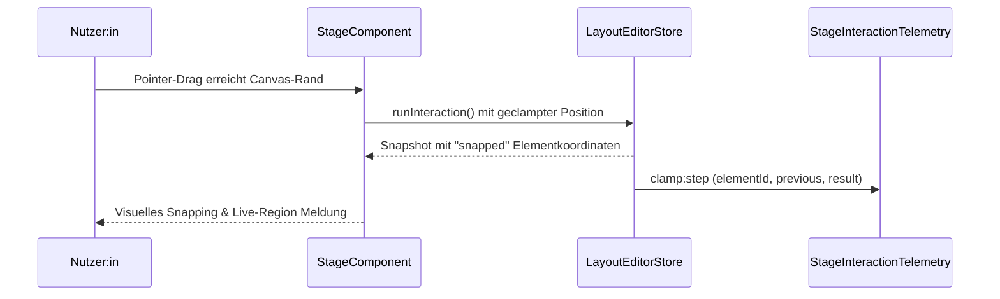

# UI Layer

Dieser Ordner enthält die UI-Hilfsfunktionen des Layout-Editors – insbesondere Menü- und Baumrendering – und stellt die Verbindung zwischen dem Store (`src/state`) und den wiederverwendbaren UI-Komponenten her.

## Struktur & Inhalte

```
ui/
├── README.md          – Leitfaden (diese Datei)
├── components/        – komplexe UI-Komponenten (Stage, DiffRenderer, Shell …)
├── editor-menu.ts     – Kontextmenüs für Canvas- und Tree-Aktionen
├── element-tree.ts    – Baumdarstellung der Elementbibliothek
├── utils/             – Low-Level-Helper (Formatierungen, Fokus-Utilities)
└── utils.ts           – Einstiegspunkt für modulübergreifende Helfer
```

## Dokumentationsinventar

| Thema | Technische Quelle | Soll-Referenz (User-Wiki) |
| --- | --- | --- |
| Stage- und Tree-Komponenten | [`components/`](components/README.md) | [Tests & Qualitätssicherung › Drag-Szenario](../../../docs/stage-instrumentation.md#tests--qualit%C3%A4tssicherung) |
| Kontextmenüs & Aktionen | [`editor-menu.ts`](editor-menu.ts) | [UI-Komponenten › Shell & Banner](../../../docs/ui-components.md#ui-komponenten-im-%C3%BCberblick) |
| Element-Baum & Bibliothek | [`element-tree.ts`](element-tree.ts) | [UI-Komponenten › Strukturbaum](../../../docs/ui-components/structure-tree.md) |
| Performance-Leitplanken | [`../../docs/ui-performance.md`](../../docs/ui-performance.md) | [Stage-Instrumentierung](../../../docs/stage-instrumentation.md) |

## Inhalte
- [`components/`](components/README.md) – Sammlung der komplexen UI-Komponenten (Stage, DiffRenderer, Shell usw.).
- [`editor-menu.ts`](editor-menu.ts) – Erzeugt kontextuelle Aktionsmenüs für Canvas- und Bauminteraktionen.
- [`element-tree.ts`](element-tree.ts) – Rendert die Element-Bibliothek als gruppierten Baum und meldet Selektionen.

## Aufgaben & Verantwortlichkeiten
- Kapselt DOM-Manipulationen, damit Presenter und Store ausschließlich Daten liefern.
- Nutzt die Basisklasse `UIComponent` aus `components/component.ts`, um Listener/Cleanups sicher zu verwalten.
- Bindet CSS-Klassen mit dem Präfix `sm-le-` und `sm-elements-` ein; neue Klassen folgen diesem Namensschema für konsistentes Styling.

## Arbeitskonventionen
- **Lebenszyklus**: UI-Komponenten müssen `mount()`/`destroy()` aus `UIComponent` nutzen. Direkte DOM-Eingriffe erfolgen nur innerhalb von `onMount`/`onDestroy` oder über `UIComponentScope`-Scopes.
- **Event-Handling**: Ereignisse immer über `scope.listen` bzw. `this.listen` registrieren, damit Cleanups automatisch laufen.
- **Element-Baum**: `ElementTreeNode.id` muss eindeutig sein; Gruppen ohne `definition` werden als reine Abschnittsüberschriften behandelt.
- **Tests**: Änderungen an UI-Hilfen erfordern Aktualisierungen in `../../tests/ui-component.test.ts` bzw. `../../tests/ui-diff-renderer.test.ts`.
- **Stage-Performance**: `StageComponent` nutzt Snapshot-Cursor und `store.runInteraction()`, um Pointer-Frames ohne zusätzliche `getState()`-Aufrufe oder doppelte Exporte abzuwickeln. Neue Interaktionen müssen diese Mechanik respektieren.

## Kernabläufe

### Fokus-Handshake Tree ⇄ Stage
1. `StructurePanelPresenter.handleSelect()` meldet die Tree-Auswahl an den Store (siehe [`../presenters/structure-panel.ts`](../presenters/structure-panel.ts)).
2. Der Store publiziert einen Snapshot mit aktualisierter Auswahl; `StageController` erhält ihn über `store.subscribe` und aktualisiert `StageComponent`.
3. Direkt nach der Store-Mutation ruft der Presenter `StageController.focusElement()` auf, wodurch Kamera- und Telemetrie-Events synchron mit dem Tree laufen.
4. `StageComponent` emittiert `focus`-Telemetrie; Analytics oder Tests abonnieren diese über `observeCamera()`.

Der Soll-Workflow inklusive Nutzerperspektive ist im User-Wiki unter [Stage-Fokus & Navigation](../../../docs/stage-instrumentation.md#kamera-telemetrie) beschrieben.

### Drag-Lifecycle auf der Stage
1. Pointer-Events werden in `StageComponent` über Scope-Listener registriert.
2. `LayoutEditorStore.runInteraction()` bündelt Move/Resize-Mutationen zu einem Frame, setzt den Export-Status dirty und liefert einen Snapshot für Stage & Tree.
3. Nach `pointerup` ruft die Stage `store.flushExport()`, wodurch Header/Notice den finalen Export erhalten.
4. Drag-State (`draggedElementId`) wird auf `null` zurückgesetzt; Tree- und Stage-Overlays verschwinden beim nächsten Snapshot.

Aus Anwendersicht ist dieser Ablauf im [User-Wiki › Stage-Bedienkonzept](../../../docs/stage-instrumentation.md#tests--qualit%C3%A4tssicherung) dokumentiert.

### Kontextmenüs & Aktionen
1. UI-Komponenten übergeben den aktuellen Fokuskontext an `createEditorMenu()`.
2. Das Menü baut Aktionen abhängig von Selektion, Rechtekontext und Feature-Flags.
3. Aktionen rufen Presenter-Methoden (z. B. `StageController.deleteSelected()`) oder Store-APIs direkt auf.
4. Persistente Folgen (Speichern, Notice) werden über den Header-Presenter gespiegelt.

Für den Nutzerablauf siehe [User-Wiki › Setup-Workflows › View-Bindings](../../../docs/README.md#setup-workflows).

### Canvas-Snapping (Clamping) Sequenz



Der Ablauf entspricht dem Soll-Zustand „Canvas-Clamp“ aus dem User-Wiki ([Tests & Qualitätssicherung › Drag-Szenario](../../../docs/stage-instrumentation.md#tests--qualit%C3%A4tssicherung)). `StageComponent` meldet das Snapping synchron an Presenter und Telemetrie; Tests für die Eventfolge befinden sich in [`../../tests/layout-editor-store.instrumentation.test.ts`](../../tests/layout-editor-store.instrumentation.test.ts).

## Weiterführende Dokumentation
- Architektur-Überblick: [`../README.md`](../README.md)
- Performance-Guidelines für UI-Widgets: [`../../docs/ui-performance.md`](../../docs/ui-performance.md)
- Projektweite Einordnung & Workflows: [`../../../README.md`](../../../README.md)
- Nutzerzentrierte Workflows & Begriffsdefinitionen: [`../../../docs/README.md`](../../../docs/README.md)
- User-Wiki-Referenz für alle Komponenten: [`../../../docs/ui-components/README.md`](../../../docs/ui-components/README.md)

## Offene Punkte

- Sequenzdiagramme & A11y-Kriterien ergänzen: [`ui-accessibility-and-diagrams.md`](../../todo/ui-accessibility-and-diagrams.md).
- Shortcut-Testabdeckung ergänzen: [`ui-shortcut-coverage.md`](../../todo/ui-shortcut-coverage.md).
